# Lab 1: Cloud Account Security and IAM Report

## Student Information
- Name: Surya
- Course: IKB42603 Cloud Computing Security Essentials 
- Lab Task: Lab 1 - Cloud Account Security and IAM
- Lecturer Name: Nor Adani Kamal Mohamad Nasir

## Overview
This report documents the implementation and verification of AWS Identity and Access Management (IAM) security practices in a controlled local environment using LocalStack. The purpose of this lab was to develop practical understanding of cloud identity management, user provisioning, access control policies, and secure credential management practices. Effective IAM configuration is essential because it forms the foundation of cloud security by controlling who can access resources and what actions they can perform. In this lab, the environment was prepared by starting and verifying LocalStack, configuring AWS CLI for local testing, and then systematically creating users with different privilege levels, organizing them into groups, attaching appropriate policies, and managing access keys following security best practices. Each task was executed using AWS CLI commands and supported by screenshots as evidence of successful implementation.

## Objectives
The objectives of this lab are:
- Install and verify Docker to support container-based AWS service simulation.
- Start and verify LocalStack to provide a local AWS environment for safe experimentation without incurring cloud costs.
- Configure AWS CLI to communicate with LocalStack so that IAM operations can be performed locally.
- Map the initial cloud identity landscape by examining existing IAM resources to understand the starting state.
- Create a least-privilege administrative user through group-based access control to demonstrate proper security architecture.
- Create a read-only user to implement the principle of least privilege for analyst roles.
- Manage access keys by creating, listing, and rotating credentials to practice secure key lifecycle management.
- Document all procedures clearly using terminal commands and screenshots as evidence of implementation.

## Learning Outcomes
By completing this lab, the student should be able to:
- Understand fundamental IAM concepts including users, groups, policies, and managed policies.
- Configure local AWS development environments using LocalStack for safe testing and experimentation.
- Implement the principle of least privilege by creating users with appropriate permission boundaries.
- Apply group-based access control strategies to simplify permission management at scale.
- Manage access key lifecycles including creation, listing, and rotation following security best practices.
- Differentiate between administrative and read-only access levels and their appropriate use cases.
- Document technical security procedures clearly using terminal commands and visual evidence.

## Environment and Prerequisites
The lab was conducted on a Windows-based environment with Docker Desktop installed and internet access for downloading container images. The following tools and conditions were required before starting the lab:
- Docker Desktop with container runtime support for running LocalStack services.
- AWS CLI v2 installed and accessible from the command line for executing IAM operations.
- Terminal or command prompt with sufficient permissions to execute Docker and AWS commands.
- LocalStack container image available or downloadable from Docker Hub.
- Basic understanding of cloud computing concepts and command-line interface operations.
- Sufficient system resources to run Docker containers without performance degradation.

---

## Step 1: Install and Verify Docker
Docker is a containerization platform that enables applications and services to run in isolated environments called containers. It is a critical tool in cloud computing and DevOps because it provides consistent, reproducible environments across different systems and eliminates the "works on my machine" problem. In this lab, Docker was required to run LocalStack, which simulates AWS services locally within a container. Verifying Docker installation ensures that the container runtime is available and functioning properly before attempting to start LocalStack.

### Purpose
- Verify that Docker is installed and operational on the local system.
- Confirm Docker version to ensure compatibility with LocalStack requirements.
- Prepare the container runtime environment for LocalStack deployment.

### Terminal Commands
```bash
docker --version
docker info
```

### Explanation of the Commands
- docker --version displays the installed Docker version number, confirming that Docker is installed and accessible from the command line.
- docker info provides detailed system-level information about the Docker installation, including the number of containers, images, server version, and runtime configuration, which helps verify that Docker is running correctly and has sufficient resources available.

### Evidence
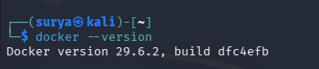

### Notes
Docker was successfully verified from the terminal using the version command. The Docker info command confirmed that the Docker daemon is running and the system has adequate resources to support container operations. This verification step is important because LocalStack depends on Docker's container runtime to simulate AWS services locally.

---

## Step 2: Start and Verify LocalStack
LocalStack is a fully functional local cloud stack that emulates AWS services in a local development environment. It is valuable for cloud development because it allows developers to test AWS applications locally without connecting to the actual AWS cloud, thereby reducing costs, improving development speed, and eliminating the risk of accidentally affecting production resources. LocalStack runs as a Docker container and exposes AWS-compatible APIs on localhost, making it possible to use standard AWS CLI commands and SDKs against a local endpoint. In this step, the LocalStack container was started and its health status was verified to ensure that the simulated AWS services were ready to accept requests.

### Purpose
- Start the LocalStack container to create a local AWS simulation environment.
- Verify that LocalStack services are running and healthy.
- Confirm that the local endpoint is accessible for AWS CLI operations.

### Terminal Commands
```bash
docker run -d --name localstack -p 4566:4566 localstack/localstack
docker ps
curl http://localhost:4566/_localstack/health
```

### Explanation of the Commands
- docker run -d --name localstack -p 4566:4566 localstack/localstack starts a new LocalStack container in detached mode (-d), assigns it the name "localstack" for easier management, and maps port 4566 on the host to port 4566 in the container, which is the primary endpoint for all LocalStack services.
- docker ps lists all currently running containers, confirming that the LocalStack container is active and operational.
- curl http://localhost:4566/_localstack/health sends an HTTP GET request to LocalStack's health check endpoint, which returns the status of all simulated AWS services, confirming that the local cloud environment is ready to accept requests.

### Evidence
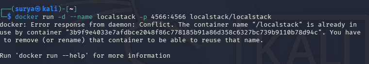

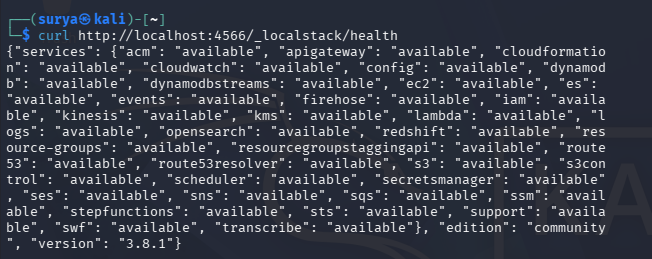

### Notes
LocalStack was successfully started and verified to be running correctly. The health check endpoint returned positive status for the IAM service, which is required for this lab. This local AWS environment provides a safe testing ground where IAM operations can be performed without risk of affecting real cloud resources or incurring costs.

---

## Step 3: Configure AWS CLI for LocalStack
Configuring AWS CLI to work with LocalStack is an essential step because the AWS CLI is designed to communicate with the real AWS cloud by default. To redirect AWS CLI commands to the local LocalStack endpoint instead, specific configuration steps are required. This configuration involves setting up dummy credentials (since LocalStack does not validate credentials in the same way as real AWS) and specifying the local endpoint URL for all subsequent commands. This setup enables developers to use familiar AWS CLI syntax and commands while testing against a local environment, which accelerates development cycles and reduces the learning curve for cloud security testing.

### Purpose
- Configure AWS CLI credentials for LocalStack compatibility.
- Set the default region for consistent command execution.
- Prepare the CLI to communicate with the local LocalStack endpoint rather than AWS cloud.

### Terminal Commands
```bash
aws configure set aws_access_key_id test
aws configure set aws_secret_access_key test
aws configure set region us-east-1
aws configure set output json
aws --endpoint-url=http://localhost:4566 sts get-caller-identity
```

### Explanation of the Commands
- aws configure set aws_access_key_id test sets the AWS access key to "test", which is a dummy credential accepted by LocalStack for local development purposes.
- aws configure set aws_secret_access_key test sets the AWS secret access key to "test", completing the dummy credential configuration.
- aws configure set region us-east-1 configures the default AWS region to us-east-1, which is a commonly used region for testing and ensures consistency across all commands.
- aws configure set output json sets the output format to JSON, which provides structured, machine-readable responses that are easier to parse and process.
- aws --endpoint-url=http://localhost:4566 sts get-caller-identity verifies the configuration by calling the Security Token Service (STS) to retrieve the caller identity, confirming that the CLI can successfully communicate with LocalStack.

### Evidence
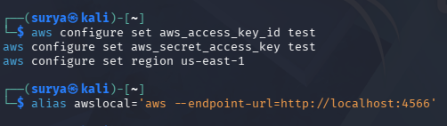

### Notes
The AWS CLI was successfully configured to communicate with LocalStack using dummy credentials and the local endpoint. The get-caller-identity command confirmed that the CLI can successfully send requests to LocalStack and receive responses. Throughout this lab, all AWS CLI commands include the --endpoint-url=http://localhost:4566 flag to direct requests to LocalStack instead of the real AWS cloud.

---

## Step 4: Task 1 - Map the Cloud Identity Landscape
Mapping the cloud identity landscape is an important preliminary step in any IAM implementation because it provides visibility into existing resources and establishes a baseline understanding of the current security posture. In a real-world scenario, organizations often inherit existing IAM configurations when taking over cloud environments, and understanding what users, groups, and policies already exist is critical before making changes. In this lab, the initial identity landscape was examined to verify that the LocalStack environment was clean and ready for new IAM resource creation. This step involved listing all users, groups, and policies to document the starting state.

### Purpose
- List all existing IAM users to understand current identity resources.
- List all IAM groups to identify existing organizational structures.
- List IAM policies to see what permission sets are available.
- Document the initial state of the IAM environment before making changes.

### Terminal Commands
```bash
aws --endpoint-url=http://localhost:4566 iam list-users
aws --endpoint-url=http://localhost:4566 iam list-groups
aws --endpoint-url=http://localhost:4566 iam list-policies --scope Local
```

### Explanation of the Commands
- aws iam list-users retrieves a list of all IAM users in the account, showing user names, creation dates, and unique identifiers, which helps identify all individual identities that have been provisioned.
- aws iam list-groups retrieves a list of all IAM groups, showing group names and creation dates, which helps understand how users might be organized for permission management.
- aws iam list-policies --scope Local lists all customer-managed policies (excluding AWS-managed policies), showing what custom permission sets have been created, which provides insight into specialized access control requirements.
- The --endpoint-url flag in each command ensures that the requests are sent to LocalStack rather than the real AWS API.


### Notes
The initial identity landscape revealed a clean environment with no existing users, no groups, and no custom policies. This confirmed that the LocalStack environment was in a pristine state and ready for IAM resource creation. In a production environment, this mapping step would typically reveal existing resources that need to be documented, analyzed, and potentially remediated according to security best practices.

### IAM Concepts Overview

This table summarizes the core IAM concepts that form the foundation of AWS identity and access management:

| Concept | AWS term | Purpose |
|---|---|---|
| All-powerful owner | Root user | The original account owner with unrestricted access to everything. Should never be used for daily tasks because if it's compromised, there's no limit to the damage. |
| Human/app identity | IAM User | Represents a specific person or application that needs to interact with AWS resources, with its own credentials and permissions. |
| Permission bundle | IAM Policy | A JSON document that defines exactly what actions are allowed or denied on which resources — the actual rules of access. |
| Collection of users | IAM Group | A way to organize multiple IAM users together so permissions can be managed once (at the group level) instead of individually. |
| Temporary identity | IAM Role | An identity that can be assumed temporarily (by a user, service, or application) to gain a specific set of permissions for a limited time, without needing permanent credentials. |

---

## Step 5: Task 2 - Create Least-Privilege Admin User
Creating a least-privilege administrative user through group-based access control demonstrates a fundamental AWS security best practice. Rather than attaching permissions directly to individual users, AWS recommends creating groups with appropriate policies attached and then adding users to those groups. This approach provides several benefits: it simplifies permission management when multiple users need the same access, makes it easier to audit who has what permissions, and reduces the risk of configuration drift where individual users accumulate excessive permissions over time. In this task, an administrative group was created with full access permissions, and then a personal admin user was created and added to that group, demonstrating proper identity architecture.

### 5.1 Create Admin Group and Attach Policy
The first step in implementing group-based access control is creating the group itself and attaching the appropriate managed policy. AWS provides managed policies that are pre-defined permission sets maintained by AWS, such as AdministratorAccess, which grants full access to all AWS services and resources.

#### Purpose
- Create an IAM group named "Admins" for administrative users.
- Attach the AdministratorAccess managed policy to grant full permissions.
- Establish a reusable permission structure that can accommodate multiple admin users.

#### Terminal Commands
```bash
aws --endpoint-url=http://localhost:4566 iam create-group --group-name Admins
aws --endpoint-url=http://localhost:4566 iam attach-group-policy --group-name Admins --policy-arn arn:aws:iam::aws:policy/AdministratorAccess
aws --endpoint-url=http://localhost:4566 iam list-attached-group-policies --group-name Admins
```

#### Explanation of the Commands
- aws iam create-group --group-name Admins creates a new IAM group with the name "Admins", which will serve as a container for administrative users.
- aws iam attach-group-policy attaches the AdministratorAccess managed policy to the Admins group using its Amazon Resource Name (ARN), granting all users in this group full access to all AWS services and resources.
- aws iam list-attached-group-policies verifies that the policy was successfully attached to the group by listing all policies associated with the Admins group.

#### Evidence
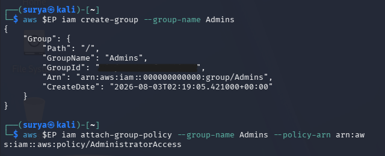

### 5.2 Create Personal Admin User
After establishing the admin group, the next step is creating an individual IAM user that will be added to this group. Creating a user separate from the root account is a critical security practice because it enables better auditing and accountability.

#### Purpose
- Create a personal IAM user for administrative tasks.
- Separate administrative access from root account usage.
- Enable individual accountability for administrative actions.

#### Terminal Commands
```bash
aws --endpoint-url=http://localhost:4566 iam create-user --user-name surya-admin
aws --endpoint-url=http://localhost:4566 iam list-users
```

#### Explanation of the Commands
- aws iam create-user --user-name surya-admin creates a new IAM user with the name "surya-admin", which will be used for administrative operations instead of the root account.
- aws iam list-users verifies that the user was created successfully by displaying all IAM users in the account, including the newly created admin user.

#### Evidence
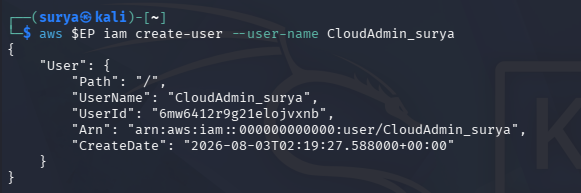

### 5.3 Add User to Admin Group
The final step in implementing group-based access control is adding the individual user to the appropriate group. This action grants the user all permissions that are attached to the group.

#### Purpose
- Add the surya-admin user to the Admins group.
- Grant administrative permissions to the user through group membership.
- Complete the group-based access control implementation.

#### Terminal Commands
```bash
aws --endpoint-url=http://localhost:4566 iam add-user-to-group --user-name surya-admin --group-name Admins
aws --endpoint-url=http://localhost:4566 iam get-group --group-name Admins
```

#### Explanation of the Commands
- aws iam add-user-to-group adds the specified user to the specified group, granting the user all permissions attached to that group through policy inheritance.
- aws iam get-group retrieves information about the specified group, including a list of all users who are members of that group, which verifies that the user was successfully added.

#### Evidence
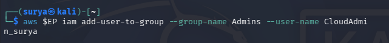

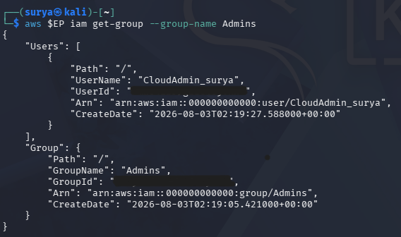

### Notes
The least-privilege admin user was successfully created following AWS best practices. By using group-based access control rather than attaching policies directly to the user, this implementation makes it easy to manage permissions consistently as the team grows. If additional administrators need to be added in the future, they can simply be added to the Admins group without needing to attach policies individually. This approach reduces administrative overhead and minimizes the risk of permission inconsistencies.

---

## Step 6: Task 3 - Create Read-Only User (Analyst)
Creating a read-only user demonstrates the principle of least privilege in action. Not all users require full administrative access; many roles only need the ability to view and audit resources without the ability to modify or delete them. Security analysts, auditors, and monitoring systems often fall into this category. By creating users with read-only access, organizations reduce the risk of accidental or malicious changes while still enabling necessary visibility into the environment. In this task, an analyst user was created and the AWS-managed ReadOnlyAccess policy was attached directly to demonstrate user-level policy attachment as an alternative to group-based access.

### 6.1 Create Analyst User
The first step is creating the IAM user that will serve as a security analyst or auditor with limited permissions.

#### Purpose
- Create an IAM user for security analysis and auditing purposes.
- Establish an identity with limited, read-only permissions.
- Demonstrate user creation for non-administrative roles.

#### Terminal Commands
```bash
aws --endpoint-url=http://localhost:4566 iam create-user --user-name analyst
aws --endpoint-url=http://localhost:4566 iam list-users
```

#### Explanation of the Commands
- aws iam create-user --user-name analyst creates a new IAM user with the name "analyst", which will be used for read-only access to AWS resources for monitoring and auditing purposes.
- aws iam list-users displays all IAM users in the account, including both the admin user and the newly created analyst user, confirming successful user creation.

#### Evidence
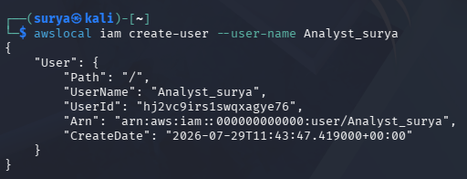

### 6.2 Attach ReadOnlyAccess Policy
After creating the user, the appropriate policy must be attached to grant the desired permissions. In this case, the ReadOnlyAccess managed policy is attached directly to the user.

#### Purpose
- Attach the ReadOnlyAccess managed policy to the analyst user.
- Grant read permissions to AWS resources without write or delete capabilities.
- Implement the principle of least privilege for analyst role.

#### Terminal Commands
```bash
aws --endpoint-url=http://localhost:4566 iam attach-user-policy --user-name analyst --policy-arn arn:aws:iam::aws:policy/ReadOnlyAccess
aws --endpoint-url=http://localhost:4566 iam list-attached-user-policies --user-name analyst
```

#### Explanation of the Commands
- aws iam attach-user-policy attaches the ReadOnlyAccess managed policy directly to the analyst user using its ARN, granting read-only permissions to AWS services and resources.
- aws iam list-attached-user-policies lists all policies attached directly to the analyst user, verifying that the ReadOnlyAccess policy was successfully attached and is now in effect.

#### Evidence
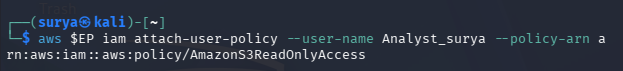

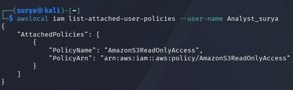

### Notes
The read-only analyst user was successfully created with appropriate limited permissions. This user can view and audit resources but cannot modify, create, or delete them, which is appropriate for security monitoring and compliance checking roles. While this task demonstrated attaching policies directly to users, it is worth noting that in production environments with multiple analysts, creating an "Analysts" group and adding users to that group would be more maintainable and consistent with the group-based access control best practice demonstrated in Task 2.

---

## Step 7: Task 4 - Access Key Management
Access keys are long-term credentials used for programmatic access to AWS services through the AWS CLI, SDKs, or APIs. While access keys are necessary for automation and application integration, they also present security risks if not managed properly. Compromised access keys can be used to access AWS resources from anywhere in the world, potentially leading to data breaches, resource abuse, or financial loss. Therefore, proper access key lifecycle management is critical for cloud security. This includes creating keys only when necessary, storing them securely, rotating them regularly, and deactivating or deleting old keys. In this task, the complete access key lifecycle was demonstrated, including listing existing keys, creating new keys, and deactivating old keys to simulate rotation.

### 7.1 List Existing Access Keys
Before creating new access keys, it is important to check what keys already exist for a user. This helps prevent accumulation of unnecessary credentials and provides visibility into the current key configuration.

#### Purpose
- List all access keys associated with the analyst user.
- Verify current key configuration before making changes.
- Establish baseline for key management operations.

#### Terminal Commands
```bash
aws --endpoint-url=http://localhost:4566 iam list-access-keys --user-name analyst
```

#### Explanation of the Commands
- aws iam list-access-keys --user-name analyst retrieves a list of all access keys associated with the specified user, showing key IDs, creation dates, and current status (Active or Inactive), which provides complete visibility into programmatic credentials for that user.

#### Evidence
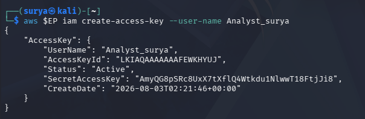

### 7.2 Create New Access Key
Creating a new access key generates a pair of credentials: an access key ID and a secret access key. These credentials can be used to authenticate API requests. The secret access key is only shown once at creation time and must be stored securely immediately.

#### Purpose
- Generate a new access key for programmatic access.
- Obtain credentials for CLI or SDK authentication.
- Demonstrate key creation process.

#### Terminal Commands
```bash
aws --endpoint-url=http://localhost:4566 iam create-access-key --user-name analyst
aws --endpoint-url=http://localhost:4566 iam list-access-keys --user-name analyst
```

#### Explanation of the Commands
- aws iam create-access-key --user-name analyst generates a new access key pair for the specified user and returns both the access key ID and secret access key in the response, which should be immediately saved to a secure location.
- aws iam list-access-keys verifies that the new key was created successfully by listing all access keys for the user, including the newly created key with its Active status.

#### Evidence
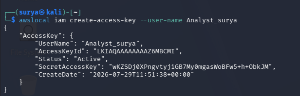

### 7.3 Deactivate Old Access Key
Access key rotation is a critical security practice that involves creating a new key, updating all applications to use the new key, and then deactivating or deleting the old key. Deactivating a key (rather than immediately deleting it) provides a safety net in case the new key has not been properly deployed everywhere it is needed.

#### Purpose
- Deactivate the old access key to complete the rotation process.
- Demonstrate secure key lifecycle management.
- Reduce the risk of compromised credentials by limiting active key lifespan.

#### Terminal Commands
```bash
aws --endpoint-url=http://localhost:4566 iam update-access-key --user-name analyst --access-key-id <ACCESS_KEY_ID> --status Inactive
aws --endpoint-url=http://localhost:4566 iam list-access-keys --user-name analyst
```

#### Explanation of the Commands
- aws iam update-access-key changes the status of a specific access key from Active to Inactive, preventing that key from being used for authentication while keeping it available in case it needs to be reactivated during a rollback scenario.
- aws iam list-access-keys verifies the status change by displaying all access keys and their current status, confirming that the old key is now inactive and only the new key is active.

#### Evidence
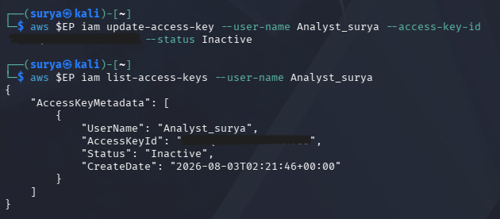

### Notes
The complete access key lifecycle was successfully demonstrated, including listing, creation, and deactivation operations. In production environments, AWS recommends rotating access keys at least every 90 days and implementing automated monitoring to detect keys that have not been rotated. After verifying that all systems are functioning correctly with the new key, the old key should be deleted entirely to eliminate the risk of its use. Additionally, organizations should consider using temporary credentials through AWS Security Token Service (STS) or IAM roles whenever possible, as these provide better security than long-term access keys.

---

## Pre-Lab Verification Checklist
The following checklist was verified based on the lab results and screenshots:

- [✓] Docker installed and verified.
- [✓] Docker version confirmed and Docker daemon running.
- [✓] LocalStack container started successfully.
- [✓] LocalStack health status verified and IAM service available.
- [✓] AWS CLI configured for LocalStack with dummy credentials.
- [✓] Initial identity landscape mapped and documented.
- [✓] Admin group created with AdministratorAccess policy attached.
- [✓] Personal admin user created and added to Admin group.
- [✓] Admin group membership verified.
- [✓] Read-only analyst user created.
- [✓] ReadOnlyAccess policy attached to analyst user.
- [✓] Analyst user permissions verified.
- [✓] Access keys listed for analyst user.
- [✓] New access key created for analyst user.
- [✓] Old access key deactivated to demonstrate rotation.

---

## Summary Table

| Item | Tool / Service | Version / Details | Status | Evidence |
|---|---|---|---|---|
| Container runtime | Docker | Docker Desktop (latest version) | Completed | screenshots/02-docker-version.png |
| Local AWS platform | LocalStack | LocalStack container running on port 4566 | Completed | screenshots/03-start-localstack.png, screenshots/04-localstack-healthy.png |
| Cloud CLI | AWS CLI v2 | Configured for LocalStack with endpoint http://localhost:4566 | Completed | screenshots/01-aws-configure.png |
| Admin group | IAM Group "Admins" | Created with AdministratorAccess policy attached | Completed | screenshots/06-task2-create-group-policy.png |
| Admin user | IAM User "surya-admin" | Created and added to Admins group | Completed | screenshots/07-task2-create-admin-user.png, screenshots/08-task2-add-user-to-group.png |
| Group membership | Admins group | Verified surya-admin membership | Completed | screenshots/09-task2-verify-membership.png |
| Analyst user | IAM User "analyst" | Created with read-only permissions | Completed | screenshots/10-task3-create-readonly-user.png |
| Read-only policy | ReadOnlyAccess | Attached to analyst user | Completed | screenshots/11-task3-attach-readonly-policy.png |
| User permissions | Analyst policies | Verified ReadOnlyAccess attached | Completed | screenshots/12-task3-list-user-permissions.png |
| Access key listing | IAM access keys | Listed keys for analyst user | Completed | screenshots/13-task4-list-access-keys.png |
| Key creation | New access key | Generated new access key for analyst | Completed | screenshots/14-task4-create-access-key.png |
| Key rotation | Key deactivation | Deactivated old access key | Completed | screenshots/15-task4-deactivate-key.png |

---

## Challenges Encountered
During the implementation of this lab, several challenges were encountered and successfully resolved:
- Ensuring that the --endpoint-url flag was consistently included in every AWS CLI command to direct requests to LocalStack rather than attempting to connect to the real AWS cloud. This required careful attention to command syntax throughout all tasks.
- Understanding the difference between attaching policies to groups versus attaching them directly to users, and recognizing when each approach is most appropriate for different organizational scenarios.
- Managing the timing of access key operations to ensure that new keys were created before old keys were deactivated, following proper rotation procedures that prevent service interruption.
- Verifying that LocalStack was fully initialized and the IAM service was healthy before executing IAM commands, as premature commands could fail if services were not yet ready.
- Documenting each step with appropriate screenshots that clearly showed the command execution and its results, requiring careful terminal window management and screen capture timing.

## Lessons Learned
This lab reinforced several important concepts and best practices in cloud identity and access management:
- The principle of least privilege is fundamental to cloud security and should be applied by granting users only the permissions they need to perform their specific job functions, nothing more.
- Group-based access control significantly simplifies permission management at scale and should be the preferred method for assigning permissions rather than attaching policies directly to individual users.
- The root account should never be used for daily operations; instead, administrative users should be created with appropriate permissions and individual accountability.
- Access key lifecycle management is critical for security, including regular rotation, secure storage, and prompt deactivation or deletion of old keys.
- IAM is a free service in AWS, making it a zero-cost security investment that provides substantial protection value.
- Testing IAM configurations in a local environment like LocalStack enables safe experimentation and learning without risk of affecting production resources or incurring cloud costs.
- Proper documentation with clear commands and visual evidence is essential for security auditing, knowledge transfer, and troubleshooting.

## References
- AWS IAM Documentation: https://docs.aws.amazon.com/IAM/latest/UserGuide/
- AWS IAM Best Practices: https://docs.aws.amazon.com/IAM/latest/UserGuide/best-practices.html
- AWS CLI IAM Command Reference: https://awscli.amazonaws.com/v2/documentation/api/latest/reference/iam/index.html
- LocalStack Documentation: https://docs.localstack.cloud/
- LocalStack IAM Service Coverage: https://docs.localstack.cloud/user-guide/aws/iam/
- Docker Documentation: https://docs.docker.com/
- AWS Security Best Practices: https://aws.amazon.com/architecture/security-identity-compliance/
- AWS Access Key Management: https://docs.aws.amazon.com/IAM/latest/UserGuide/id_credentials_access-keys.html
- IAM Policy Simulator: https://policysim.aws.amazon.com/
- AWS Well-Architected Framework - Security Pillar: https://docs.aws.amazon.com/wellarchitected/latest/security-pillar/welcome.html

## Conclusion
The Cloud Account Security and IAM lab was completed successfully with all objectives achieved. The lab provided comprehensive hands-on experience with fundamental IAM concepts including user provisioning, group-based access control, policy attachment, and access key lifecycle management. All tasks were executed in a safe local environment using LocalStack, which eliminated the risk of affecting production resources while providing realistic AWS API behavior. The implementation demonstrated critical security best practices such as the principle of least privilege, separation of administrative and read-only access, group-based permission management, and secure credential rotation. Through systematic execution of IAM commands and careful documentation with screenshots, this lab established a strong foundation for managing cloud identities and implementing access control policies in cloud computing environments. The skills and knowledge gained from this lab are directly applicable to real-world cloud security implementations and will support continued learning in cloud computing security essentials.
