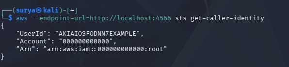

# Lab 1: Cloud Account Security and IAM Report

## Student Information
- Name: Surya Giri A/L Shanker
- Course: IKB42603 Cloud Computing Security Essentials 
- Lab Task: Lab 1 - Cloud Account Security and IAM
- Lecturer Name: Nor Adani Kamal Mohamad Nasir

## Overview
This report documents the implementation and verification of identity and access management security practices across two distinct computing platforms: cloud services (AWS IAM) and container orchestration (Kubernetes RBAC). The lab was conducted in two sessions over two weeks. Session A focused on AWS Identity and Access Management in a controlled local environment using LocalStack, covering user provisioning, group-based access control, policy attachment, and secure credential management. Session B extended these security principles to Kubernetes environments using kind (Kubernetes IN Docker), demonstrating namespace isolation, Role-Based Access Control (RBAC), and enforced access boundaries. The purpose of this comprehensive lab was to develop practical understanding of identity management, access control policies, and the principle of least privilege as applied across different computing paradigms. Effective access control is essential because it forms the foundation of security in both cloud and container environments by controlling who can access resources and what actions they can perform. Both sessions were executed using command-line tools (AWS CLI and kubectl) against local development environments, and each task was systematically documented with terminal commands and screenshots as evidence of successful implementation.

## Objectives
The objectives of this lab across both sessions are:

**Session A Objectives (LocalStack IAM):**
- Install and verify Docker to support container-based AWS service simulation.
- Start and verify LocalStack to provide a local AWS environment for safe experimentation without incurring cloud costs.
- Configure AWS CLI to communicate with LocalStack so that IAM operations can be performed locally.
- Map the initial cloud identity landscape by examining existing IAM resources to understand the starting state.
- Create a least-privilege administrative user through group-based access control to demonstrate proper security architecture.
- Create a read-only user to implement the principle of least privilege for analyst roles.
- Manage access keys by creating, listing, and rotating credentials to practice secure key lifecycle management.

**Session B Objectives (Kubernetes RBAC):**
- Create a local Kubernetes cluster using kind for safe RBAC experimentation without cloud costs.
- Implement namespace-based isolation to separate development and production environments within a single cluster.
- Create a service account to establish an identity for access control testing.
- Define a Role with limited permissions following the principle of least privilege.
- Bind the Role to the service account using a RoleBinding to activate permissions.
- Test access controls to verify that RBAC policies correctly enforce allowed and denied operations.
- Verify RBAC configuration by examining role binding definitions.

**Common Objectives:**
- Document all procedures clearly using terminal commands and screenshots as evidence of implementation.
- Understand and apply the principle of least privilege across different computing platforms.
- Practice identity and access management in safe local environments before applying to production systems.

## Learning Outcomes
By completing this lab across both sessions, the student should be able to:

**Session A Outcomes (AWS IAM):**
- Understand fundamental IAM concepts including users, groups, policies, and managed policies.
- Configure local AWS development environments using LocalStack for safe testing and experimentation.
- Implement the principle of least privilege by creating users with appropriate permission boundaries.
- Apply group-based access control strategies to simplify permission management at scale.
- Manage access key lifecycles including creation, listing, and rotation following security best practices.
- Differentiate between administrative and read-only access levels and their appropriate use cases.

**Session B Outcomes (Kubernetes RBAC):**
- Understand Kubernetes RBAC concepts including service accounts, roles, role bindings, and namespaces.
- Create and manage local Kubernetes clusters using kind for development and testing.
- Implement namespace-based isolation to separate environments within a single cluster.
- Define roles with specific permissions following the principle of least privilege.
- Connect identities to permissions through role bindings to implement access controls.
- Test and verify access control policies using kubectl authorization commands.

**Common Outcomes:**
- Recognize that identity and access management principles (least privilege, separation of concerns, explicit permissions) apply across different computing platforms.
- Document technical security procedures clearly using terminal commands and visual evidence.
- Understand the difference between authentication (proving identity) and authorization (granting permissions) in security systems.

## Environment and Prerequisites
The lab was conducted on a Windows-based environment with Docker Desktop installed and internet access for downloading container images. The following tools and conditions were required before starting the lab:

**Session A Prerequisites (LocalStack IAM):**
- Docker Desktop with container runtime support for running LocalStack services.
- AWS CLI v2 installed and accessible from the command line for executing IAM operations.
- Terminal or command prompt with sufficient permissions to execute Docker and AWS commands.
- LocalStack container image available or downloadable from Docker Hub.
- Basic understanding of cloud computing concepts and command-line interface operations.

**Session B Prerequisites (Kubernetes RBAC):**
- Kind (Kubernetes IN Docker) tool installed for creating local Kubernetes clusters.
- Kubectl command-line tool installed for interacting with Kubernetes clusters.
- Docker Desktop with sufficient resources to run Kubernetes control plane and worker node containers.
- Basic understanding of container orchestration and Kubernetes concepts.

**Common Prerequisites:**
- Sufficient system resources (CPU, memory, disk) to run Docker containers without performance degradation.
- Administrative privileges on the local system for installing tools and managing containers.
- Stable internet connection for downloading container images and documentation access.

---

# Session A (Week 1) — Cloud Identity with LocalStack IAM

## Step 1: Install and Verify Docker
Docker is a containerization platform that enables applications and services to run in isolated environments called containers. It is a critical tool in cloud computing and DevOps because it provides consistent, reproducible environments across different systems and eliminates the "works on my machine" problem. In this lab, Docker was required to run LocalStack, which simulates AWS services locally within a container. Verifying Docker installation ensures that the container runtime is available and functioning properly before attempting to start LocalStack.

### Purpose
- Verify that Docker is installed and operational on the local system.
- Confirm Docker version to ensure compatibility with LocalStack requirements.
- Prepare the container runtime environment for LocalStack deployment.

### Terminal Commands
```bash
docker --version
docker info
```

### Explanation of the Commands
- docker --version displays the installed Docker version number, confirming that Docker is installed and accessible from the command line.
- docker info provides detailed system-level information about the Docker installation, including the number of containers, images, server version, and runtime configuration, which helps verify that Docker is running correctly and has sufficient resources available.

### Evidence


### Notes
Docker was successfully verified from the terminal using the version command. The Docker info command confirmed that the Docker daemon is running and the system has adequate resources to support container operations. This verification step is important because LocalStack depends on Docker's container runtime to simulate AWS services locally.

---

## Step 2: Start and Verify LocalStack
LocalStack is a fully functional local cloud stack that emulates AWS services in a local development environment. It is valuable for cloud development because it allows developers to test AWS applications locally without connecting to the actual AWS cloud, thereby reducing costs, improving development speed, and eliminating the risk of accidentally affecting production resources. LocalStack runs as a Docker container and exposes AWS-compatible APIs on localhost, making it possible to use standard AWS CLI commands and SDKs against a local endpoint. In this step, the LocalStack container was started and its health status was verified to ensure that the simulated AWS services were ready to accept requests.

### Purpose
- Start the LocalStack container to create a local AWS simulation environment.
- Verify that LocalStack services are running and healthy.
- Confirm that the local endpoint is accessible for AWS CLI operations.

### Terminal Commands
```bash
docker run -d --name localstack -p 4566:4566 localstack/localstack
curl http://localhost:4566/_localstack/health
```

### Explanation of the Commands
- docker run -d --name localstack -p 4566:4566 localstack/localstack starts a new LocalStack container in detached mode (-d), assigns it the name "localstack" for easier management, and maps port 4566 on the host to port 4566 in the container, which is the primary endpoint for all LocalStack services.
- curl http://localhost:4566/_localstack/health sends an HTTP GET request to LocalStack's health check endpoint, which returns the status of all simulated AWS services, confirming that the local cloud environment is ready to accept requests.

### Evidence


### Notes
LocalStack was successfully started and verified to be running correctly. The health check endpoint returned positive status for the IAM service, which is required for this lab. This local AWS environment provides a safe testing ground where IAM operations can be performed without risk of affecting real cloud resources or incurring costs.

---

## Step 3: Configure AWS CLI for LocalStack
Configuring AWS CLI to work with LocalStack is an essential step because the AWS CLI is designed to communicate with the real AWS cloud by default. To redirect AWS CLI commands to the local LocalStack endpoint instead, specific configuration steps are required. This configuration involves setting up dummy credentials (since LocalStack does not validate credentials in the same way as real AWS) and specifying the local endpoint URL for all subsequent commands. This setup enables developers to use familiar AWS CLI syntax and commands while testing against a local environment, which accelerates development cycles and reduces the learning curve for cloud security testing.

### Purpose
- Configure AWS CLI credentials for LocalStack compatibility.
- Set the default region for consistent command execution.
- Prepare the CLI to communicate with the local LocalStack endpoint rather than AWS cloud.

### Terminal Commands
```bash
aws configure set aws_access_key_id test
aws configure set aws_secret_access_key test
aws configure set region us-east-1
aws configure set output json
aws --endpoint-url=http://localhost:4566 sts get-caller-identity
```

### Explanation of the Commands
- aws configure set aws_access_key_id test sets the AWS access key to "test", which is a dummy credential accepted by LocalStack for local development purposes.
- aws configure set aws_secret_access_key test sets the AWS secret access key to "test", completing the dummy credential configuration.
- aws configure set region us-east-1 configures the default AWS region to us-east-1, which is a commonly used region for testing and ensures consistency across all commands.
- aws configure set output json sets the output format to JSON, which provides structured, machine-readable responses that are easier to parse and process.
- aws --endpoint-url=http://localhost:4566 sts get-caller-identity verifies the configuration by calling the Security Token Service (STS) to retrieve the caller identity, confirming that the CLI can successfully communicate with LocalStack.

### Evidence




### Notes
The AWS CLI was successfully configured to communicate with LocalStack using dummy credentials and the local endpoint. The get-caller-identity command confirmed that the CLI can successfully send requests to LocalStack and receive responses. Throughout this lab, all AWS CLI commands include the --endpoint-url=http://localhost:4566 flag to direct requests to LocalStack instead of the real AWS cloud.

---

## Step 4: Task 1 - Map the Cloud Identity Landscape
Mapping the cloud identity landscape is an important preliminary step in any IAM implementation because it provides visibility into existing resources and establishes a baseline understanding of the current security posture. In a real-world scenario, organizations often inherit existing IAM configurations when taking over cloud environments, and understanding what users, groups, and policies already exist is critical before making changes. In this lab, the initial identity landscape was examined to verify that the LocalStack environment was clean and ready for new IAM resource creation. This step involved listing all users, groups, and policies to document the starting state.

### Purpose
- List all existing IAM users to understand current identity resources.
- List all IAM groups to identify existing organizational structures.
- List IAM policies to see what permission sets are available.
- Document the initial state of the IAM environment before making changes.

### Terminal Commands
```bash
aws --endpoint-url=http://localhost:4566 iam list-users
aws --endpoint-url=http://localhost:4566 iam list-groups
aws --endpoint-url=http://localhost:4566 iam list-policies --scope Local
```

### Explanation of the Commands
- aws iam list-users retrieves a list of all IAM users in the account, showing user names, creation dates, and unique identifiers, which helps identify all individual identities that have been provisioned.
- aws iam list-groups retrieves a list of all IAM groups, showing group names and creation dates, which helps understand how users might be organized for permission management.
- aws iam list-policies --scope Local lists all customer-managed policies (excluding AWS-managed policies), showing what custom permission sets have been created, which provides insight into specialized access control requirements.
- The --endpoint-url flag in each command ensures that the requests are sent to LocalStack rather than the real AWS API.


### Notes
The initial identity landscape revealed a clean environment with no existing users, no groups, and no custom policies. This confirmed that the LocalStack environment was in a pristine state and ready for IAM resource creation. In a production environment, this mapping step would typically reveal existing resources that need to be documented, analyzed, and potentially remediated according to security best practices.

### IAM Concepts Overview

This table summarizes the core IAM concepts that form the foundation of AWS identity and access management:

| Concept | AWS term | Purpose |
|---|---|---|
| All-powerful owner | Root user | The original account owner with unrestricted access to everything. Should never be used for daily tasks because if it's compromised, there's no limit to the damage. |
| Human/app identity | IAM User | Represents a specific person or application that needs to interact with AWS resources, with its own credentials and permissions. |
| Permission bundle | IAM Policy | A JSON document that defines exactly what actions are allowed or denied on which resources — the actual rules of access. |
| Collection of users | IAM Group | A way to organize multiple IAM users together so permissions can be managed once (at the group level) instead of individually. |
| Temporary identity | IAM Role | An identity that can be assumed temporarily (by a user, service, or application) to gain a specific set of permissions for a limited time, without needing permanent credentials. |

---

## Step 5: Task 2 - Create Least-Privilege Admin User
Creating a least-privilege administrative user through group-based access control demonstrates a fundamental AWS security best practice. Rather than attaching permissions directly to individual users, AWS recommends creating groups with appropriate policies attached and then adding users to those groups. This approach provides several benefits: it simplifies permission management when multiple users need the same access, makes it easier to audit who has what permissions, and reduces the risk of configuration drift where individual users accumulate excessive permissions over time. In this task, an administrative group was created with full access permissions, and then a personal admin user was created and added to that group, demonstrating proper identity architecture.

### 5.1 Create Admin Group and Attach Policy
The first step in implementing group-based access control is creating the group itself and attaching the appropriate managed policy. AWS provides managed policies that are pre-defined permission sets maintained by AWS, such as AdministratorAccess, which grants full access to all AWS services and resources.

#### Purpose
- Create an IAM group named "Admins" for administrative users.
- Attach the AdministratorAccess managed policy to grant full permissions.
- Establish a reusable permission structure that can accommodate multiple admin users.

#### Terminal Commands
```bash
aws --endpoint-url=http://localhost:4566 iam create-group --group-name Admins
aws --endpoint-url=http://localhost:4566 iam attach-group-policy --group-name Admins --policy-arn arn:aws:iam::aws:policy/AdministratorAccess
aws --endpoint-url=http://localhost:4566 iam list-attached-group-policies --group-name Admins
```

#### Explanation of the Commands
- aws iam create-group --group-name Admins creates a new IAM group with the name "Admins", which will serve as a container for administrative users.
- aws iam attach-group-policy attaches the AdministratorAccess managed policy to the Admins group using its Amazon Resource Name (ARN), granting all users in this group full access to all AWS services and resources.
- aws iam list-attached-group-policies verifies that the policy was successfully attached to the group by listing all policies associated with the Admins group.

#### Evidence


### 5.2 Create Personal Admin User
After establishing the admin group, the next step is creating an individual IAM user that will be added to this group. Creating a user separate from the root account is a critical security practice because it enables better auditing and accountability.

#### Purpose
- Create a personal IAM user for administrative tasks.
- Separate administrative access from root account usage.
- Enable individual accountability for administrative actions.

#### Terminal Commands
```bash
aws --endpoint-url=http://localhost:4566 iam create-user --user-name surya-admin
aws --endpoint-url=http://localhost:4566 iam list-users
```

#### Explanation of the Commands
- aws iam create-user --user-name surya-admin creates a new IAM user with the name "surya-admin", which will be used for administrative operations instead of the root account.
- aws iam list-users verifies that the user was created successfully by displaying all IAM users in the account, including the newly created admin user.

#### Evidence


### 5.3 Add User to Admin Group
The final step in implementing group-based access control is adding the individual user to the appropriate group. This action grants the user all permissions that are attached to the group.

#### Purpose
- Add the surya-admin user to the Admins group.
- Grant administrative permissions to the user through group membership.
- Complete the group-based access control implementation.

#### Terminal Commands
```bash
aws --endpoint-url=http://localhost:4566 iam add-user-to-group --user-name surya-admin --group-name Admins
aws --endpoint-url=http://localhost:4566 iam get-group --group-name Admins
```

#### Explanation of the Commands
- aws iam add-user-to-group adds the specified user to the specified group, granting the user all permissions attached to that group through policy inheritance.
- aws iam get-group retrieves information about the specified group, including a list of all users who are members of that group, which verifies that the user was successfully added.

#### Evidence


### Notes
The least-privilege admin user was successfully created following AWS best practices. By using group-based access control rather than attaching policies directly to the user, this implementation makes it easy to manage permissions consistently as the team grows. If additional administrators need to be added in the future, they can simply be added to the Admins group without needing to attach policies individually. This approach reduces administrative overhead and minimizes the risk of permission inconsistencies.

---

## Step 6: Task 3 - Create Read-Only User (Analyst)
Creating a read-only user demonstrates the principle of least privilege in action. Not all users require full administrative access; many roles only need the ability to view and audit resources without the ability to modify or delete them. Security analysts, auditors, and monitoring systems often fall into this category. By creating users with read-only access, organizations reduce the risk of accidental or malicious changes while still enabling necessary visibility into the environment. In this task, an analyst user was created and the AWS-managed ReadOnlyAccess policy was attached directly to demonstrate user-level policy attachment as an alternative to group-based access.

### 6.1 Create Analyst User
The first step is creating the IAM user that will serve as a security analyst or auditor with limited permissions.

#### Purpose
- Create an IAM user for security analysis and auditing purposes.
- Establish an identity with limited, read-only permissions.
- Demonstrate user creation for non-administrative roles.

#### Terminal Commands
```bash
aws --endpoint-url=http://localhost:4566 iam create-user --user-name analyst
aws --endpoint-url=http://localhost:4566 iam list-users
```

#### Explanation of the Commands
- aws iam create-user --user-name analyst creates a new IAM user with the name "analyst", which will be used for read-only access to AWS resources for monitoring and auditing purposes.
- aws iam list-users displays all IAM users in the account, including both the admin user and the newly created analyst user, confirming successful user creation.

#### Evidence


### 6.2 Attach ReadOnlyAccess Policy
After creating the user, the appropriate policy must be attached to grant the desired permissions. In this case, the ReadOnlyAccess managed policy is attached directly to the user.

#### Purpose
- Attach the ReadOnlyAccess managed policy to the analyst user.
- Grant read permissions to AWS resources without write or delete capabilities.
- Implement the principle of least privilege for analyst role.

#### Terminal Commands
```bash
aws --endpoint-url=http://localhost:4566 iam attach-user-policy --user-name analyst --policy-arn arn:aws:iam::aws:policy/ReadOnlyAccess
aws --endpoint-url=http://localhost:4566 iam list-attached-user-policies --user-name analyst
```

#### Explanation of the Commands
- aws iam attach-user-policy attaches the ReadOnlyAccess managed policy directly to the analyst user using its ARN, granting read-only permissions to AWS services and resources.
- aws iam list-attached-user-policies lists all policies attached directly to the analyst user, verifying that the ReadOnlyAccess policy was successfully attached and is now in effect.

#### Evidence


### Notes
The read-only analyst user was successfully created with appropriate limited permissions. This user can view and audit resources but cannot modify, create, or delete them, which is appropriate for security monitoring and compliance checking roles. While this task demonstrated attaching policies directly to users, it is worth noting that in production environments with multiple analysts, creating an "Analysts" group and adding users to that group would be more maintainable and consistent with the group-based access control best practice demonstrated in Task 2.

---

## Step 7: Task 4 - Access Key Management
Access keys are long-term credentials used for programmatic access to AWS services through the AWS CLI, SDKs, or APIs. While access keys are necessary for automation and application integration, they also present security risks if not managed properly. Compromised access keys can be used to access AWS resources from anywhere in the world, potentially leading to data breaches, resource abuse, or financial loss. Therefore, proper access key lifecycle management is critical for cloud security. This includes creating keys only when necessary, storing them securely, rotating them regularly, and deactivating or deleting old keys. In this task, the complete access key lifecycle was demonstrated, including creating new keys, listing all keys for verification, and deactivating old keys to simulate rotation.

### 7.1 Create New Access Key for the Analyst
Creating a new access key generates a pair of credentials: an access key ID and a secret access key. These credentials can be used to authenticate API requests and enable programmatic access to AWS services. The secret access key is only shown once at creation time and must be stored securely immediately.

#### Purpose
- Generate a new access key for programmatic access to AWS services.
- Obtain credentials for CLI or SDK authentication.
- Enable the analyst user to interact with AWS APIs.

#### Terminal Commands
```bash
aws --endpoint-url=http://localhost:4566 iam create-access-key --user-name analyst
```

#### Explanation of the Commands
- aws iam create-access-key --user-name analyst generates a new access key pair for the specified user and returns both the access key ID and secret access key in the response, which should be immediately saved to a secure location for use in programmatic access to AWS services.

#### Evidence


### 7.2 List Access Keys
After creating a new access key, it is important to list all keys associated with a user to verify the creation was successful and to see the current status of all credentials. This provides complete visibility into the programmatic credentials configured for the user.

#### Purpose
- List all access keys associated with the analyst user.
- Verify that the new key was created successfully.
- View the current status and configuration of all access keys.

#### Terminal Commands
```bash
aws --endpoint-url=http://localhost:4566 iam list-access-keys --user-name analyst
```

#### Explanation of the Commands
- aws iam list-access-keys --user-name analyst retrieves a list of all access keys associated with the specified user, showing key IDs, creation dates, and current status (Active or Inactive), which provides complete visibility into programmatic credentials for that user and confirms successful key creation.

#### Evidence


### 7.3 Deactivate Old Access Key (Rotation)
Access key rotation is a critical security practice that involves creating a new key, updating all applications to use the new key, and then deactivating or deleting the old key. Deactivating a key (rather than immediately deleting it) provides a safety net in case the new key has not been properly deployed everywhere it is needed.

#### Purpose
- Deactivate the old access key to complete the rotation process.
- Demonstrate secure key lifecycle management.
- Reduce the risk of compromised credentials by limiting active key lifespan.

#### Terminal Commands
```bash
aws --endpoint-url=http://localhost:4566 iam update-access-key --user-name analyst --access-key-id <ACCESS_KEY_ID> --status Inactive
aws --endpoint-url=http://localhost:4566 iam list-access-keys --user-name analyst
```

#### Explanation of the Commands
- aws iam update-access-key changes the status of a specific access key from Active to Inactive, preventing that key from being used for authentication while keeping it available in case it needs to be reactivated during a rollback scenario.
- aws iam list-access-keys verifies the status change by displaying all access keys and their current status, confirming that the old key is now inactive and only the new key is active.

#### Evidence


### Notes
The complete access key lifecycle was successfully demonstrated, including listing, creation, and deactivation operations. In production environments, AWS recommends rotating access keys at least every 90 days and implementing automated monitoring to detect keys that have not been rotated. After verifying that all systems are functioning correctly with the new key, the old key should be deleted entirely to eliminate the risk of its use. Additionally, organizations should consider using temporary credentials through AWS Security Token Service (STS) or IAM roles whenever possible, as these provide better security than long-term access keys.

---

# Session B (Week 2) — Enforced Access Control with Kubernetes RBAC

## Step 8: Setup - Create a Local Kubernetes Cluster
Kubernetes is an open-source container orchestration platform that automates the deployment, scaling, and management of containerized applications. It has become the de facto standard for cloud-native application deployment because it provides consistent infrastructure abstractions across different cloud providers and on-premises environments. In cloud computing security, Kubernetes introduces new identity and access control challenges because multiple users, services, and applications need carefully controlled access to cluster resources. To practice Kubernetes security locally without cloud costs, this lab uses kind (Kubernetes IN Docker), which runs a complete Kubernetes cluster inside Docker containers. Creating a local Kubernetes cluster enables safe experimentation with RBAC policies, namespace isolation, and access control enforcement in a production-like environment.

### Purpose
- Create a local Kubernetes cluster for practicing RBAC and access control.
- Verify cluster health and connectivity using kubectl commands.
- Establish a safe testing environment for security policy experimentation.

### Terminal Commands
```bash
kind create cluster --name ccse-lab1
kubectl cluster-info --context kind-ccse-lab1
kubectl get nodes
```

### Explanation of the Commands
- kind create cluster --name ccse-lab1 creates a new Kubernetes cluster named "ccse-lab1" running inside Docker containers, providing a fully functional control plane and worker nodes for local development and testing.
- kubectl cluster-info --context kind-ccse-lab1 displays connection information about the cluster, including the Kubernetes control plane URL and CoreDNS service, confirming that kubectl can successfully communicate with the cluster API server.
- kubectl get nodes lists all nodes in the cluster and shows their status, confirming that the cluster is operational and ready to accept workload deployments.

### Evidence


### Notes
The local Kubernetes cluster was successfully created and verified. Unlike LocalStack which simulates AWS services, kind runs a real Kubernetes cluster with actual control plane components, making it an authentic environment for learning Kubernetes security concepts. The cluster runs entirely within Docker containers, requiring no virtual machines or cloud resources, which makes it lightweight and fast to create and destroy. This cluster provides the foundation for implementing namespace-based isolation and role-based access control in subsequent tasks.

---

## Step 9: Task 5 - Separate Environments with Namespaces
Namespaces in Kubernetes provide logical isolation between different environments, teams, or applications running within the same physical cluster. They are analogous to folders in a filesystem or VPCs in cloud networking—they create boundaries that help organize resources and implement access controls. In enterprise Kubernetes deployments, namespaces are used to separate development, staging, and production environments, or to isolate different teams or projects from each other. Namespaces are critical for multi-tenancy because they enable resource quotas, network policies, and RBAC rules to be applied at the namespace level, ensuring that users and applications can only access resources within their designated boundaries. In this task, separate namespaces were created for development and production environments to demonstrate environment isolation.

### Purpose
- Create separate namespaces for development and production environments.
- Demonstrate logical isolation within a single Kubernetes cluster.
- Establish namespace boundaries for applying RBAC policies.

### Terminal Commands
```bash
kubectl create namespace dev
kubectl create namespace prod
kubectl get namespaces
```

### Explanation of the Commands
- kubectl create namespace dev creates a new namespace named "dev" that will serve as an isolated environment for development workloads, with its own resource quotas and access policies.
- kubectl create namespace prod creates a new namespace named "prod" for production workloads, ensuring that production resources are logically separated from development resources and can have stricter access controls.
- kubectl get namespaces lists all namespaces in the cluster, including both the newly created namespaces and the default system namespaces like kube-system, kube-public, and kube-node-lease, confirming successful namespace creation.

### Evidence


### Notes
The development and production namespaces were successfully created, establishing clear environment boundaries within the cluster. This separation is fundamental to implementing the principle of least privilege in Kubernetes because it enables access controls to be scoped to specific environments. For example, developers might have full access to the dev namespace but no access to prod, while production operations teams might have read-only access to dev and controlled write access to prod. Namespace isolation also supports resource management by allowing administrators to set CPU and memory quotas per namespace, preventing one environment from consuming all cluster resources.

---

## Step 10: Task 6 - Define a Role and Bind It (Least Privilege)
Role-Based Access Control (RBAC) is Kubernetes' native authorization mechanism for controlling what actions users and service accounts can perform on cluster resources. RBAC works by defining Roles (which specify allowed actions on resources) and RoleBindings (which grant those roles to specific users or service accounts). This model implements the principle of least privilege by explicitly defining permissions rather than relying on implicit or overly broad access. In Kubernetes, RBAC is essential because the default service account in a namespace has minimal permissions by design, and any application or user requiring access to cluster resources must be explicitly granted those permissions through RBAC policies. In this task, a complete RBAC configuration was implemented by creating a service account, defining a role with limited permissions, and binding that role to the service account.

### 10.1 Create Service Account
A service account is a special type of identity in Kubernetes designed for applications and processes running inside pods. Unlike user accounts (which represent humans), service accounts provide programmatic identities that can be granted specific permissions through RBAC.

#### Purpose
- Create a service account for a development user identity.
- Establish an identity that can be granted specific permissions through RBAC.
- Demonstrate service account creation as the foundation for access control.

#### Terminal Commands
```bash
kubectl create serviceaccount dev-user -n dev
kubectl get serviceaccounts -n dev
```

#### Explanation of the Commands
- kubectl create serviceaccount dev-user -n dev creates a new service account named "dev-user" in the dev namespace, providing a distinct identity that can be used by applications or users in that environment and can be granted permissions through role bindings.
- kubectl get serviceaccounts -n dev lists all service accounts in the dev namespace, including the default service account and the newly created dev-user account, confirming successful creation.

#### Evidence


### 10.2 Create Role with Read-Only Pod Permissions
After creating the service account, a Role must be defined that specifies exactly what actions are allowed on which resources. This Role will grant read-only permissions on pods within the dev namespace.

#### Purpose
- Define a Role with specific, limited permissions.
- Grant only read access to pods (list and get operations).
- Implement the principle of least privilege by denying write operations.

#### Terminal Commands
```bash
kubectl create role pod-reader --verb=get,list --resource=pods -n dev
kubectl get role pod-reader -n dev -o yaml
```

#### Explanation of the Commands
- kubectl create role pod-reader --verb=get,list --resource=pods -n dev creates a new Role named "pod-reader" in the dev namespace that allows only "get" and "list" operations on pod resources, explicitly excluding write operations like create, update, delete, or patch.
- kubectl get role pod-reader -n dev -o yaml retrieves the complete YAML definition of the created role, showing the exact permissions defined including the API groups, resources, and verbs, which confirms the role was created with the correct restricted permissions.

#### Evidence


### 10.3 Bind Role to Service Account
The final step in implementing RBAC is creating a RoleBinding that connects the Role (which defines permissions) to the service account (which represents an identity). This binding activates the permissions.

#### Purpose
- Create a RoleBinding to grant the pod-reader role to the dev-user service account.
- Activate the RBAC permissions by connecting identity to role.
- Complete the least-privilege access control configuration.

#### Terminal Commands
```bash
kubectl create rolebinding dev-user-binding --role=pod-reader --serviceaccount=dev:dev-user -n dev
kubectl get rolebinding dev-user-binding -n dev -o yaml
```

#### Explanation of the Commands
- kubectl create rolebinding dev-user-binding --role=pod-reader --serviceaccount=dev:dev-user -n dev creates a RoleBinding named "dev-user-binding" that grants the pod-reader role to the dev-user service account in the dev namespace, thereby authorizing that service account to perform get and list operations on pods.
- kubectl get rolebinding dev-user-binding -n dev -o yaml retrieves the complete YAML definition of the role binding, showing the connection between the role and the service account, confirming that the binding was created correctly and the permissions are now active.

#### Evidence


### Notes
The complete RBAC configuration was successfully implemented following the principle of least privilege. The dev-user service account now has explicit, limited permissions: it can list and view pods in the dev namespace, but cannot create, modify, or delete pods, and has no access to other namespaces or other resource types. This demonstrates proper security architecture where permissions are granted explicitly and minimally rather than broadly. In production environments, RBAC policies would be defined for all users, service accounts, and applications, ensuring that every identity has exactly the permissions it needs and no more.

---

## Step 11: Task 7 - Test That Access Control Works
Testing access control policies is a critical step in security implementation because it verifies that the RBAC rules are functioning as intended. Without testing, there is no confirmation that the principle of least privilege is actually being enforced—misconfigurations could grant excessive permissions or fail to grant necessary permissions. Kubernetes provides the "kubectl auth can-i" command specifically for this purpose, allowing administrators to check whether a particular identity has permission to perform a specific action without actually attempting that action. This testing approach is safe and non-destructive because it only queries the authorization system without making any changes to cluster resources. In this task, the RBAC configuration was tested to verify that the dev-user service account can list pods in the dev namespace but cannot delete pods or access other namespaces.

### Purpose
- Verify that the dev-user service account can list pods in the dev namespace.
- Confirm that the service account cannot delete pods (write permission denied).
- Confirm that the service account cannot access resources in the prod namespace.
- Validate that RBAC policies are correctly enforcing least-privilege access.

### Terminal Commands
```bash
SA=system:serviceaccount:dev:dev-user
kubectl auth can-i list pods -n dev --as=$SA      # Should be YES
kubectl auth can-i delete pods -n dev --as=$SA    # Should be NO
kubectl auth can-i list pods -n prod --as=$SA     # Should be NO
```

### Explanation of the Commands
- SA=system:serviceaccount:dev:dev-user creates a shell variable containing the fully qualified service account identifier, which follows the Kubernetes naming convention for service account principals and simplifies subsequent commands.
- kubectl auth can-i list pods -n dev --as=$SA queries the authorization system to determine whether the dev-user service account has permission to list pods in the dev namespace, which should return "yes" because the pod-reader role grants list permissions.
- kubectl auth can-i delete pods -n dev --as=$SA tests whether the service account can delete pods in the dev namespace, which should return "no" because the pod-reader role only grants read operations (get and list), not write operations (delete).
- kubectl auth can-i list pods -n prod --as=$SA verifies that the service account cannot access resources in the prod namespace, which should return "no" because the RoleBinding was scoped to the dev namespace only, demonstrating namespace-level access isolation.

### Evidence


### Notes
The access control tests confirmed that RBAC is correctly enforcing the intended security policies. The dev-user service account has exactly the permissions it was granted: read-only access to pods in the dev namespace, with no write permissions and no access to other namespaces. This demonstrates both the principle of least privilege (minimal permissions granted) and namespace isolation (access boundaries enforced). The distinction between authentication (proving who you are) and authorization (determining what you can do) is critical here—Kubernetes authenticates the service account identity and then uses RBAC to authorize specific actions based on the roles and bindings configured. In production environments, this testing process should be repeated for all users and service accounts to ensure that security policies are correctly implemented before deploying applications.

---

## Step 12: Verification Command
Verification commands provide proof of configuration by displaying the actual YAML definitions of security resources in the cluster. While testing commands (like kubectl auth can-i) verify the behavior of access controls, verification commands show the underlying configuration that produces that behavior. This is important for security auditing, troubleshooting, and documentation because it provides transparency into what policies are actually applied. The RoleBinding YAML definition shows the complete configuration including which role is granted, which service account receives the role, and which namespace the binding applies to.

### Purpose
- Display the complete RBAC configuration for audit and verification.
- Prove that the role binding exists and is correctly configured.
- Provide transparency into the access control implementation.

### Terminal Commands
```bash
kubectl get rolebinding dev-user-binding -n dev -o yaml
```

### Explanation of the Commands
- kubectl get rolebinding dev-user-binding -n dev -o yaml retrieves the complete YAML manifest for the specified role binding, showing all configuration details including the role reference (pod-reader), the subject reference (dev-user service account), and metadata such as creation timestamp and resource version, providing complete visibility into the RBAC configuration.

### Evidence


### Notes
The verification command successfully displayed the complete RoleBinding configuration, confirming that all RBAC components are correctly connected. The YAML output shows the binding between the pod-reader role and the dev-user service account within the dev namespace, providing auditable proof of the security configuration. In compliance and security audit scenarios, this type of verification command output would be collected and preserved as evidence that proper access controls are implemented. Additionally, these YAML definitions can be stored in version control systems as infrastructure-as-code, enabling teams to track changes to security policies over time and implement security configurations consistently across multiple clusters.

---

## Short-Answer Questions

**Q1.** Why is attaching policies to groups better than attaching them directly to users?

**Answer:**
Attaching policies to a group means permissions are managed in one place instead of user-by-user. When you needed to grant admin rights, you attached AdministratorAccess once to the Admins group, and any user added to that group like (CloudAdmin_surya) automatically inherits those permissions. If policy requirements change later, you update the group once and every member is updated instead of having to individually edit dozens of users, which is error-prone and hard to audit at scale.

---

**Q2.** What is the difference between an IAM User and an IAM Role?

**Answer:**
An IAM User is a permanent identity tied to a specific person or application, with long-term credentials (like the access keys you created for Analyst_surya). An IAM Role, by contrast, has no permanent credentials of its own and it's assumed temporarily by a user, application, or service to gain a specific set of permissions for a limited session, after which those permissions expire. Roles are preferred for reducing the risk of long-lived, potentially leaked credentials.

---

**Q3.** Explain least privilege using the Analyst account, and how it reduces blast radius if compromised.

**Answer:**
The Analyst_surya user was only granted AmazonS3ReadOnlyAccess, meaning it can view S3 data but cannot modify, delete, or access any other AWS service. If this account's credentials were stolen, the attacker would be limited to read-only access on S3  they couldn't create new IAM users, delete resources, or pivot into other services. Compare this to the

---

**Q4.** In Kubernetes, what is the difference between a Role and a RoleBinding?

**Answer:**
A Role defines what permissions exist a set of allowed actions (verbs like get, list, watch) on specific resources (like pods) within a namespace. It doesn't grant access to anyone by itself. A RoleBinding is what actually grants those permissions to a specific identity it connects the Role to a subject (a user, group, or service account like dev-user). In other words: the Role is the permission set, and the RoleBinding is the assignment of that permission set to someone.

---

**Q5.** Why did the developer service account fail to access prod, and which security principle does that demonstrate?

**Answer:**
The dev-user service account's RoleBinding only exists in the dev namespace, bound to a Role that's also scoped to dev. Kubernetes RBAC is namespace-scoped by default, so those permissions simply don't extend into prod there's no Role or RoleBinding granting dev-user any access there. This demonstrates least privilege (and by extension, authorization boundaries): the identity was authenticated successfully, but authorization correctly blocked the action because it was never explicitly granted, even within the same cluster.

---

## Security Best-Practices Checklist

The following security best practices were implemented and verified throughout this lab:

- [✓] Root user is not used for daily tasks (a dedicated admin identity exists).
- [✓] Permissions are granted via groups/roles, not directly to individual users.
- [✓] At least one least-privilege (read-only) identity was created and tested.
- [✓] Access keys were listed and a rotation (deactivate) was demonstrated.
- [✓] Kubernetes RBAC blocks an unauthorised action (delete / cross-namespace).

---

## Pre-Lab Verification Checklist
The following checklist was verified based on the lab results and screenshots:

**Session A (Week 1) - LocalStack IAM:**
- [✓] Docker installed and verified.
- [✓] Docker version confirmed and Docker daemon running.
- [✓] LocalStack container started successfully.
- [✓] LocalStack health status verified and IAM service available.
- [✓] AWS CLI configured for LocalStack with dummy credentials.
- [✓] Initial identity landscape mapped and documented.
- [✓] Admin group created with AdministratorAccess policy attached.
- [✓] Personal admin user created and added to Admin group.
- [✓] Admin group membership verified.
- [✓] Read-only analyst user created.
- [✓] ReadOnlyAccess policy attached to analyst user.
- [✓] Analyst user permissions verified.
- [✓] Access keys listed for analyst user.
- [✓] New access key created for analyst user.
- [✓] Old access key deactivated to demonstrate rotation.

**Session B (Week 2) - Kubernetes RBAC:**
- [✓] Kind tool available for creating local Kubernetes cluster.
- [✓] Kubernetes cluster created and verified operational.
- [✓] Cluster nodes confirmed healthy and ready.
- [✓] Development namespace created for environment isolation.
- [✓] Production namespace created for environment separation.
- [✓] Service account created in dev namespace.
- [✓] RBAC role created with read-only pod permissions.
- [✓] Role binding created connecting role to service account.
- [✓] Access control tested with kubectl auth can-i commands.
- [✓] List pods permission verified (allowed in dev namespace).
- [✓] Delete pods permission tested (denied as expected).
- [✓] Cross-namespace access tested (denied in prod namespace).
- [✓] Role binding configuration retrieved and verified.
- [✓] Complete RBAC implementation documented with evidence.

---

## Summary Table

| Item | Tool / Service | Version / Details | Status | Evidence |
|---|---|---|---|---|
| **Session A (Week 1) - LocalStack IAM** |||||
| Container runtime | Docker | Docker Desktop (latest version) | Completed | screenshots/02-docker-version.png |
| Local AWS platform | LocalStack | LocalStack container running on port 4566 | Completed | screenshots/03-start-localstack.png, screenshots/04-localstack-healthy.png |
| Cloud CLI | AWS CLI v2 | Configured for LocalStack with endpoint http://localhost:4566 | Completed | screenshots/01-aws-configure.png, screenshots/01b-aws-configure-2.png |
| Admin group | IAM Group "Admins" | Created with AdministratorAccess policy attached | Completed | screenshots/06-task2-create-group-policy.png |
| Admin user | IAM User "surya-admin" | Created and added to Admins group | Completed | screenshots/07-task2-create-admin-user.png, screenshots/08-task2-add-user-to-group.png |
| Group membership | Admins group | Verified surya-admin membership | Completed | screenshots/09-task2-verify-membership.png |
| Analyst user | IAM User "analyst" | Created with read-only permissions | Completed | screenshots/10-task3-create-readonly-user.png |
| Read-only policy | ReadOnlyAccess | Attached to analyst user | Completed | screenshots/11-task3-attach-readonly-policy.png |
| User permissions | Analyst policies | Verified ReadOnlyAccess attached | Completed | screenshots/12-task3-list-user-permissions.png |
| Access key listing | IAM access keys | Listed keys for analyst user | Completed | screenshots/13-task4-list-access-keys.png |
| Key creation | New access key | Generated new access key for analyst | Completed | screenshots/14-task4-create-access-key.png |
| Key rotation | Key deactivation | Deactivated old access key | Completed | screenshots/15-task4-deactivate-key.png |
| **Session B (Week 2) - Kubernetes RBAC** |||||
| Local K8s cluster | kind | Kubernetes IN Docker cluster "ccse-lab1" | Completed | screenshots/session b create the cluster.png, screenshots/session b confirm the cluster is up.png |
| Dev namespace | Kubernetes namespace | Created "dev" namespace for development | Completed | screenshots/session b task 5- seperate environments with namespace 1.png |
| Prod namespace | Kubernetes namespace | Created "prod" namespace for production | Completed | screenshots/session b task5- seperate environments with namespace 2.png |
| Service account | K8s ServiceAccount | Created "dev-user" in dev namespace | Completed | screenshots/session b task 6 create a service account.png |
| RBAC Role | K8s Role | Created "pod-reader" with list/get pod permissions | Completed | screenshots/session b task 6 create a role.png |
| Role binding | K8s RoleBinding | Bound pod-reader role to dev-user | Completed | screenshots/session b task 6 bind the role.png |
| Access control test | kubectl auth can-i | Verified RBAC enforcement (allow/deny tests) | Completed | screenshots/session b task 7 test that access control works.png |
| RBAC verification | RoleBinding YAML | Retrieved complete binding configuration | Completed | screenshots/session b verification command.png |

---

## Challenges Encountered
During the implementation of this lab across both sessions, several challenges were encountered and successfully resolved:

**Session A Challenges (LocalStack IAM):**
- Ensuring that the --endpoint-url flag was consistently included in every AWS CLI command to direct requests to LocalStack rather than attempting to connect to the real AWS cloud. This required careful attention to command syntax throughout all tasks.
- Understanding the difference between attaching policies to groups versus attaching them directly to users, and recognizing when each approach is most appropriate for different organizational scenarios.
- Managing the timing of access key operations to ensure that new keys were created before old keys were deactivated, following proper rotation procedures that prevent service interruption.
- Verifying that LocalStack was fully initialized and the IAM service was healthy before executing IAM commands, as premature commands could fail if services were not yet ready.
- Documenting each step with appropriate screenshots that clearly showed the command execution and its results, requiring careful terminal window management and screen capture timing.

**Session B Challenges (Kubernetes RBAC):**
- Understanding the relationship between Roles, RoleBindings, and ServiceAccounts as three distinct components that must be correctly connected to implement working access controls.
- Properly formatting the service account identifier in the fully qualified format (system:serviceaccount:namespace:name) for use in authorization testing commands.
- Recognizing that Roles and RoleBindings are namespace-scoped resources, meaning they must be created in the namespace where they will be used and cannot grant permissions across namespaces.
- Distinguishing between authentication (proving identity) and authorization (granting permissions), understanding that creating a service account only establishes identity but does not grant any permissions until a role is bound to it.
- Testing access controls using kubectl auth can-i commands to verify policies without making actual changes to resources, which requires understanding the --as flag for impersonation testing.

## Lessons Learned
This lab reinforced several important concepts and best practices in cloud identity and access management across both cloud platforms and container orchestration:

**Session A Lessons (LocalStack IAM):**
- The principle of least privilege is fundamental to cloud security and should be applied by granting users only the permissions they need to perform their specific job functions, nothing more.
- Group-based access control significantly simplifies permission management at scale and should be the preferred method for assigning permissions rather than attaching policies directly to individual users.
- The root account should never be used for daily operations; instead, administrative users should be created with appropriate permissions and individual accountability.
- Access key lifecycle management is critical for security, including regular rotation, secure storage, and prompt deactivation or deletion of old keys.
- IAM is a free service in AWS, making it a zero-cost security investment that provides substantial protection value.
- Testing IAM configurations in a local environment like LocalStack enables safe experimentation and learning without risk of affecting production resources or incurring cloud costs.

**Session B Lessons (Kubernetes RBAC):**
- Kubernetes RBAC provides fine-grained access control by separating identity (ServiceAccounts) from permissions (Roles) and connecting them through bindings (RoleBindings).
- Namespaces provide logical isolation within a single cluster, enabling multi-tenant environments where different teams or applications are separated by security boundaries.
- The principle of least privilege applies equally to Kubernetes as to cloud IAM—service accounts should receive only the minimum permissions required for their function.
- Testing access controls using kubectl auth can-i is essential for verifying that RBAC policies are correctly configured before deploying applications or granting user access.
- Role-based access control scales better than individual permission grants because roles can be reused across multiple identities and changed centrally to affect all bound subjects.
- Namespace-scoped RBAC (Roles and RoleBindings) provides better security than cluster-scoped RBAC (ClusterRoles and ClusterRoleBindings) by limiting the blast radius of permissions.

**Cross-Platform Lessons:**
- Both AWS IAM and Kubernetes RBAC implement the same security principles (least privilege, separation of concerns, explicit deny by default) but with different terminology and mechanisms.
- Local development environments (LocalStack for AWS, kind for Kubernetes) are invaluable for learning security concepts safely without cloud costs or production risks.
- Proper documentation with clear commands and visual evidence is essential for security auditing, knowledge transfer, and troubleshooting in both cloud and container environments.
- Identity and access management is a critical security foundation regardless of platform—whether managing cloud resources or container workloads.

## References
- AWS IAM Documentation: https://docs.aws.amazon.com/IAM/latest/UserGuide/
- AWS IAM Best Practices: https://docs.aws.amazon.com/IAM/latest/UserGuide/best-practices.html
- AWS CLI IAM Command Reference: https://awscli.amazonaws.com/v2/documentation/api/latest/reference/iam/index.html
- LocalStack Documentation: https://docs.localstack.cloud/
- LocalStack IAM Service Coverage: https://docs.localstack.cloud/user-guide/aws/iam/
- Docker Documentation: https://docs.docker.com/
- AWS Security Best Practices: https://aws.amazon.com/architecture/security-identity-compliance/
- AWS Access Key Management: https://docs.aws.amazon.com/IAM/latest/UserGuide/id_credentials_access-keys.html
- IAM Policy Simulator: https://policysim.aws.amazon.com/
- AWS Well-Architected Framework - Security Pillar: https://docs.aws.amazon.com/wellarchitected/latest/security-pillar/welcome.html
- Kubernetes Documentation: https://kubernetes.io/docs/
- Kubernetes RBAC Documentation: https://kubernetes.io/docs/reference/access-authn-authz/rbac/
- Kubernetes Namespace Documentation: https://kubernetes.io/docs/concepts/overview/working-with-objects/namespaces/
- Kind (Kubernetes IN Docker) Documentation: https://kind.sigs.k8s.io/
- Kubectl Command Reference: https://kubernetes.io/docs/reference/kubectl/
- Kubernetes Service Accounts: https://kubernetes.io/docs/concepts/security/service-accounts/
- Kubernetes Security Best Practices: https://kubernetes.io/docs/concepts/security/
- RBAC Authorization Mode: https://kubernetes.io/docs/reference/access-authn-authz/rbac/

## Conclusion
The Cloud Account Security and IAM lab was completed successfully across two comprehensive sessions, with all objectives achieved in both cloud identity management and container access control. Session A provided hands-on experience with AWS Identity and Access Management concepts using LocalStack, including user provisioning, group-based access control, policy attachment, and access key lifecycle management. Session B extended these security principles to Kubernetes environments, demonstrating namespace-based isolation, RBAC implementation with service accounts, roles, and role bindings, and comprehensive access control testing. Both sessions were executed in safe local environments—LocalStack for AWS and kind for Kubernetes—which eliminated the risk of affecting production resources while providing realistic platform behavior.

The implementation demonstrated critical security best practices that apply across both cloud platforms and container orchestration systems: the principle of least privilege ensures identities receive only necessary permissions, separation of concerns divides identity from permissions with explicit bindings, group-based or role-based access control simplifies permission management at scale, and namespace or account isolation provides security boundaries between environments. Through systematic execution of IAM and RBAC commands with careful documentation using screenshots, this lab established a strong foundation for managing identities and implementing access controls in modern cloud computing and container environments.

The skills and knowledge gained from both sessions are directly applicable to real-world security implementations across multiple platforms. Understanding IAM prepares students for managing cloud resources in AWS, Azure, or Google Cloud, while mastering Kubernetes RBAC is essential for securing containerized applications in production environments. The common security principles that underpin both systems—explicit permissions, least privilege, defense in depth, and continuous testing—form the foundation of cloud security engineering and will support continued learning and professional practice in cloud computing security essentials.

